##ОТЧЁТ О ЛАБОРАТОРНОЙ РАБОТЕ №6 

## ПО ОСНОВАМ ПРОГРАММИРОВАНИЯ

###Ход работы:

На сайте GitHub сделал копию https://github.com/Kurtyanik/LR6/

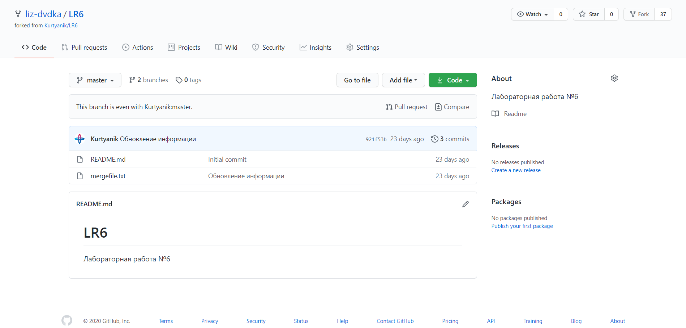

С помощью команды _cd Desktop/lab6_ в консоли Git Bash перешла в созданную на рабочем столе папку lab6

Использовал команду _git init_ чтобы инициализировать гит в данной папке

Командой _git remote add origin_ связала папку с удалённым репозиторием на сайте GitHub

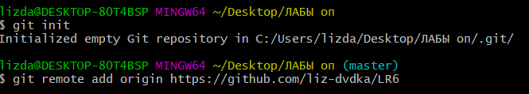

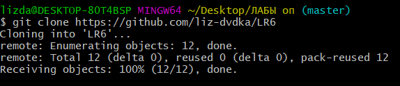

Затем через графический интерфейс GitHub добавил новый файл _Index.html_ в удалённый репозиторий и добавила его в ветку __master__

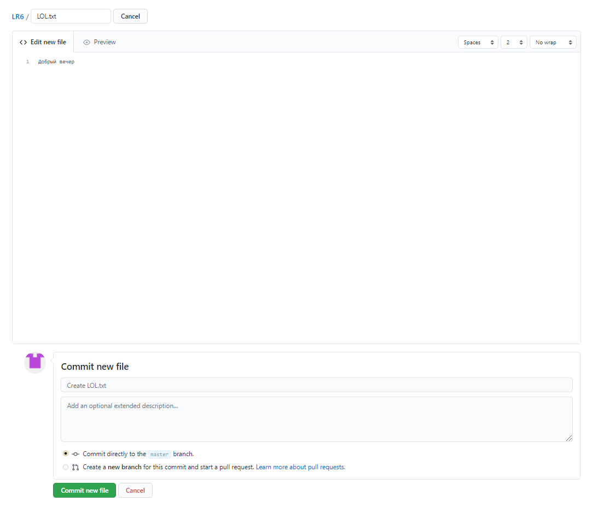

Пользуясь командой _git pull origin master_ загрузила изменения из удалённого репозитория в локальный

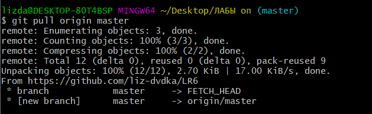

Командой _git log_ получила список операций/коммитов

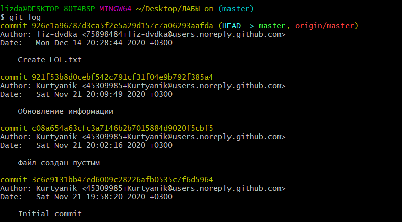

Используя _git show *commit SHA-1*_ получила более подробную информацию по последнему изменению

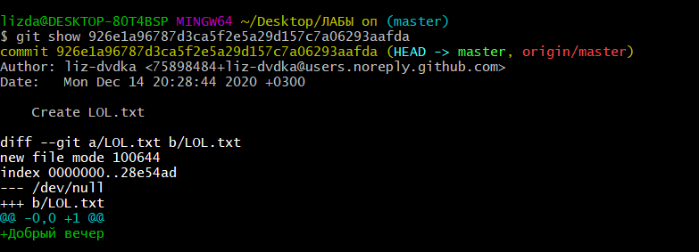

Командой _git checkout -t branch1_ переключилась на другую ветку **branch1**

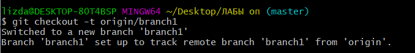

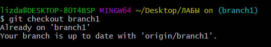

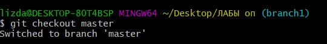

Попыталась выполнить слияние веток **master** и **branch1** командой _git merge branch1_ и получила ошибку

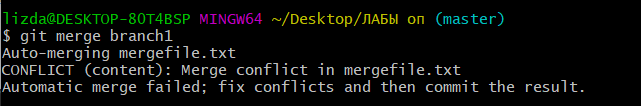

Вручную изменила файл mergefile.txt, вызвавший ошибку слияния и выполнил коммит

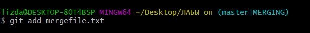

Выполнила слияние веток **master** и **branch1** а затем удалил ветку **branch1** командой _git branch -d branch1_

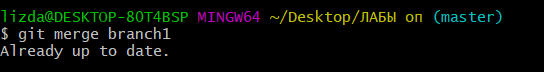

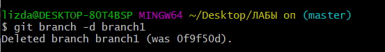

Запушила всё в удалённый репозиторий командой _git push origin master_ (Строка logon failed вылезает из-за какой-то внутренней ошибки)

Затем сделала несколько изменений, добавив новые файлы

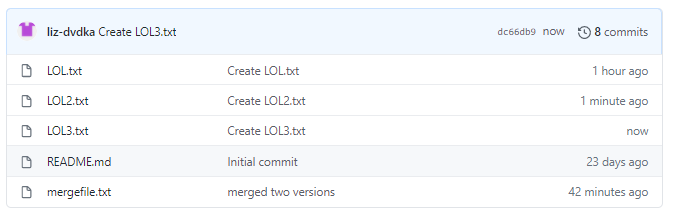

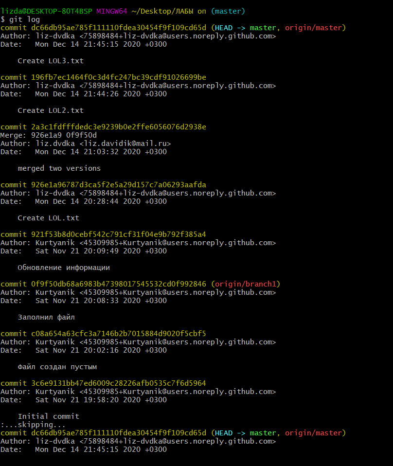

Командой _git reset --hard HEAD~1_ выполнила откат последнего коммита - добавления файла **Новый текстовый документ.txt**

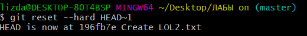

Запушила изменённую ветку

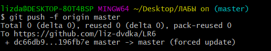

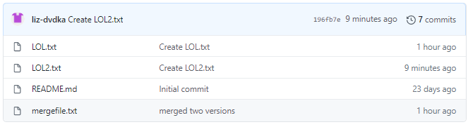

Пользуясь командой _git checkout -b otchet_ создала новую ветку **otchet**

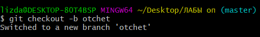

Текущая история _git log --graph_ . Аргумент --graph позволяет графически изобразить ветки и коммиты на них

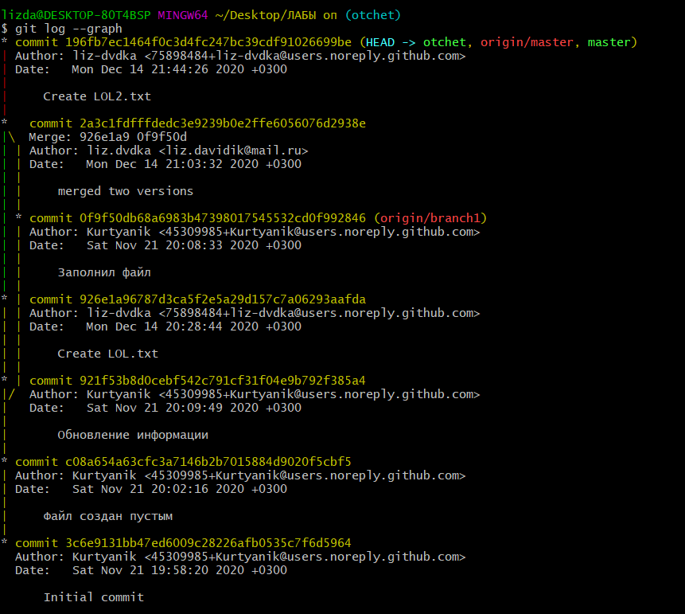

С помощью команды _git add ._ подготовила все новые файлы в папке **lab6** к пушу

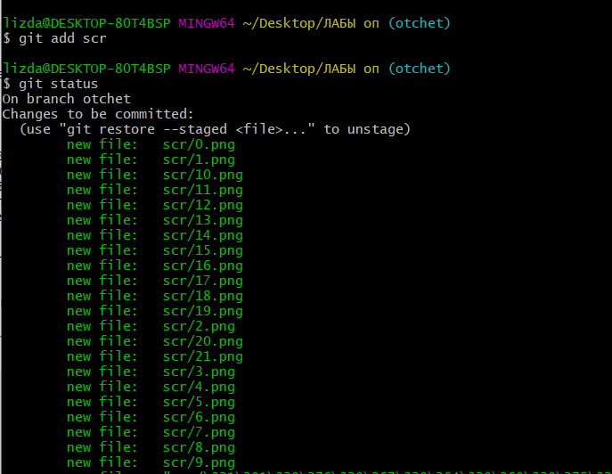

Запушила файлы скриншотов в удалённый репозиторий

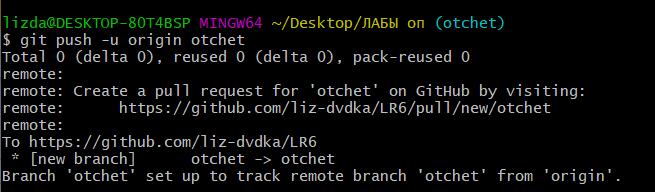

Оформила отчёт в файле **README.md** используя блокнот

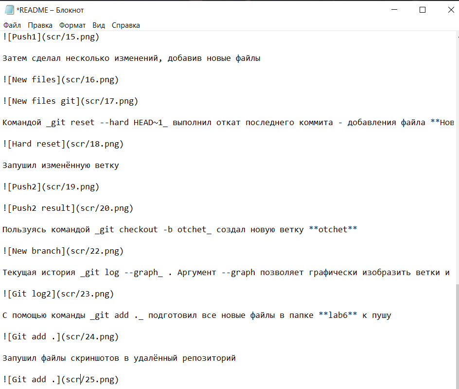

Лог команд из папки **.git/logs**

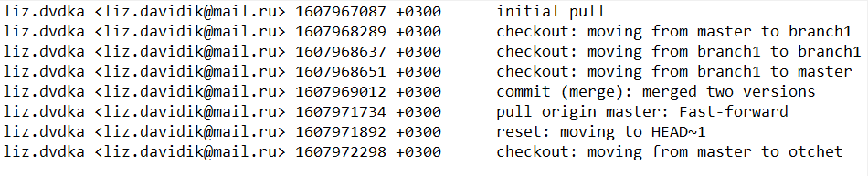

Финальный результат команды _git log_

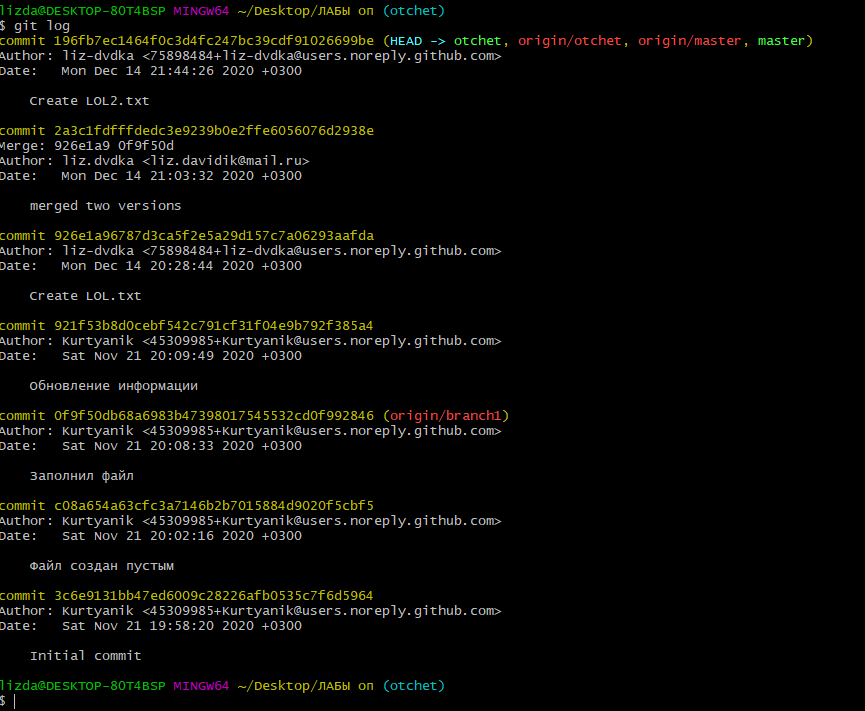

Все файлы скриншотов лежат в папке **scr**
